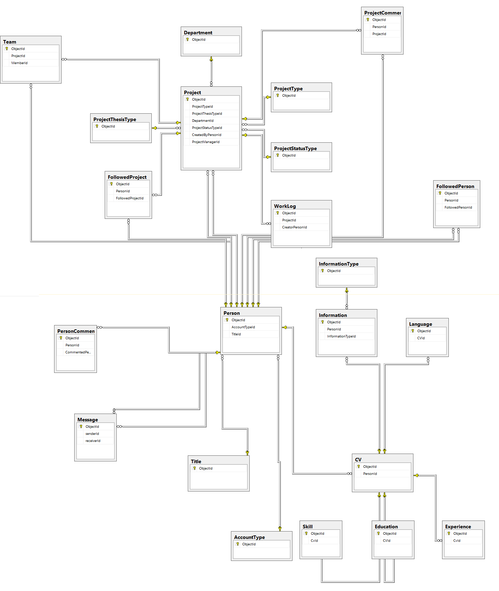

Developer Guide
===============

Database Design
---------------

**Modern way of working!**

**Academic Freelance offers you to work on ITU projects which vary and we guarantee that you will find YOUR project to work on!**

**Every members of ITU can register and create projects. You will develop your skills by working on professional projects and  connect new people from the university!**

    Following diagram shows Academic Freelance database design. In Academic Freelance, fifteen dynamic and seven look-up tables ara implemented, which means totally twenty two tables are used.

Code
----

**Note:** File folders indexing is following:

    - *./classes* includes class description which depends the entities coming from database.
    - *./classes/operations* includes class methods.
    - *./static* file includes css and javascript files.
    - *./templates* includes HMTL files which means front-end side.
    - *./templates_operations* includes python code related to HTML files which means server side development.

.. toctree::
   member1
   member2
   member3
   member4
   member5
