Parts Implemented by Ece Naz Sefercioğlu
================================

** CV, Experience and Message tables are implemented.**

Related Parts to CV
-------------------

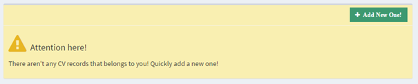

There is a warning in the main CV that encourages CV adding, if the user does not have any CVs.

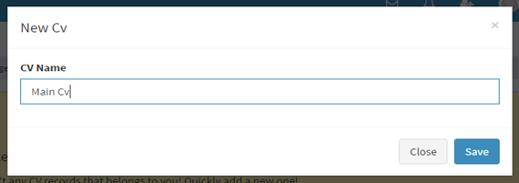

A new CV can be added by clicking the ‘Add New One’ Button on the right top of the page.

A modal will pop-up asking for a name the new CV and by clicking 'Add' button it is added to user's  account.

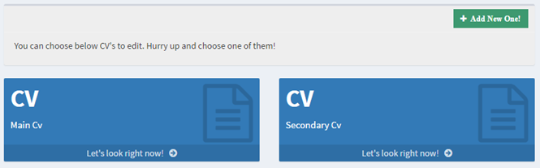

More than one CV can be added to a profile. And they can be edited by clicking their ‘Let’s look right now’ link.

And CV details will be loaded to the page down below.

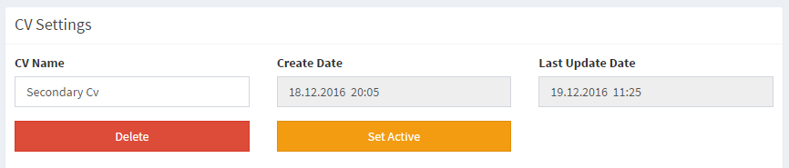

A CV can be set active or deleted from the CV setting.

Moreover, updates can be kept track on the Last Update Section.

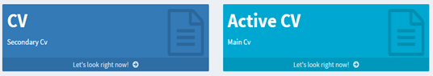

If a CV is active, it will take a brighter blue color and the information it contains, can be shown on the user's profile page.

Related Parts to Experience
---------------------------

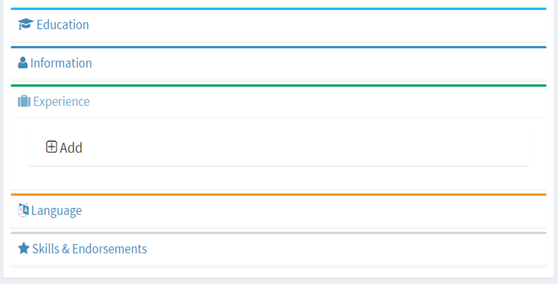

Experiences can be add to CVs through CV information accordion under 'Experience part'.

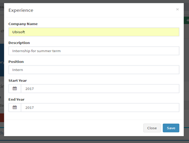

When the user clicks to 'Add' button. A modal with textboxes and datepickers, would pop-up and wait for the user input.

Company Name is for the company experience carried on. Description is for a brief description about the experience.

Position is the position user worked under and lastly, Start Year and End Year are for showing the duration of the experience.

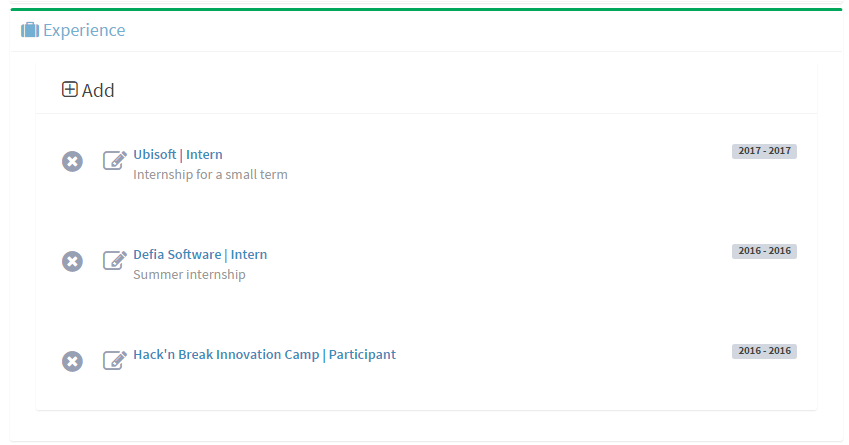

The way experience information shown on CV page is shown on above screenshot.

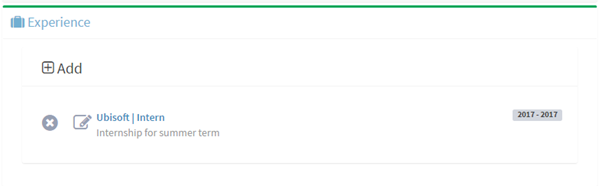

Users can update their CV information by clicking the edit icon on that experience's section.

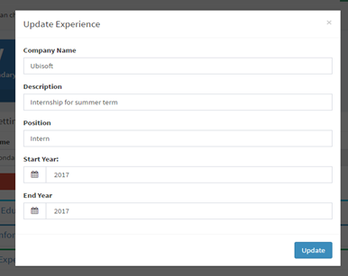

A filled modal would pup-up and the user can make the changes on parts which he wants to update.

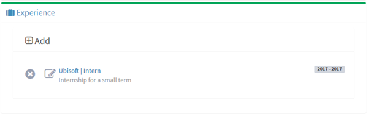

Lastly, any experience can be deleted by clicking the cross icon on that experience's section.

Related Parts to Message
------------------------

There are three ways for a user to reach messaging page.

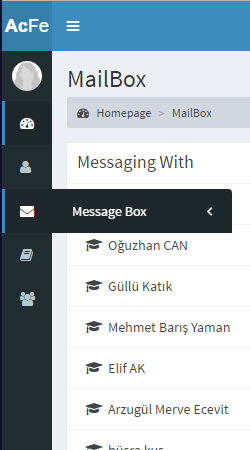

First, by clicking the message sub-menu on the left main navigation menu.

Secondly, by clicking the message icon on the upper user bar.

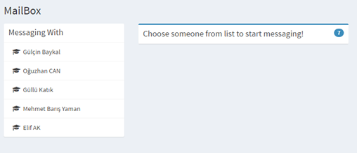

This way of reaching the messaging main page is implementing the first and second ways.

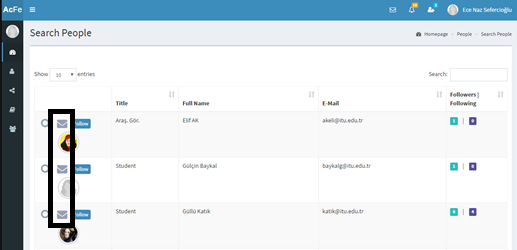

Lastly, a user can direct to a messaging history page with a person by clicking the message icon beside the user name on search person page.

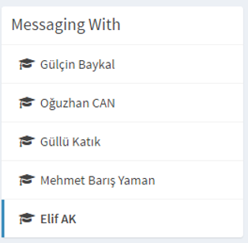

Person bar for messaging

Moreover the user can go through all of his messaging history by simply clicking on the user name beside the messagebox.

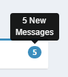

When the user directed to the messaging page, user can see how many unread messages he has on the upper left of the messagebox inside the blue circle.

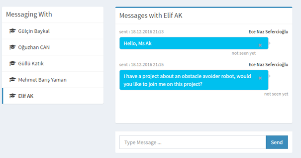

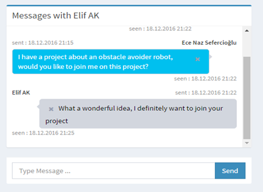

Through messaging, a user can see when his message is read or is it seen at all.

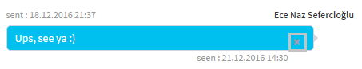

Messages can be deleted by clicking the cross buttons on message boxes.

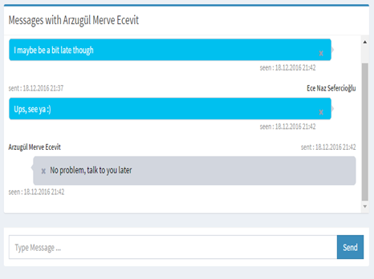

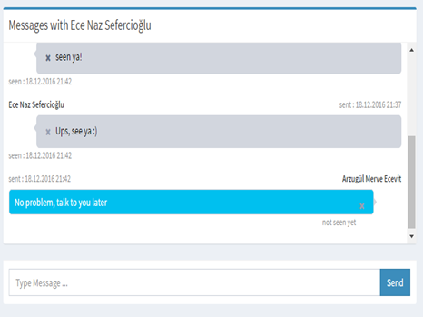

On our site when a user deletes a message, the other side of the conversation still keeps the message.

