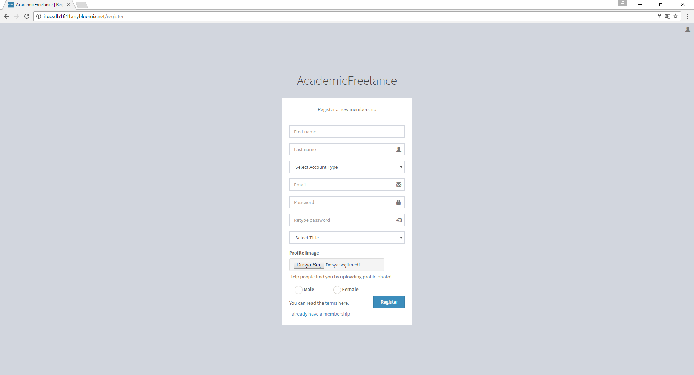
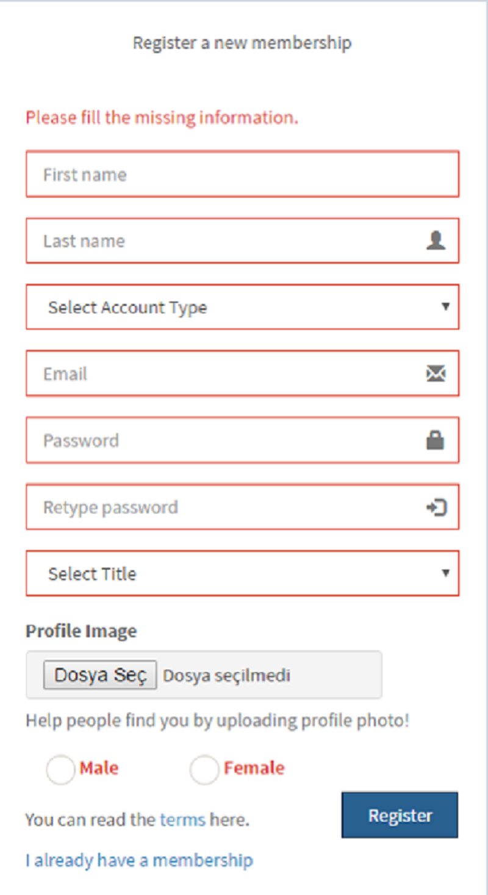
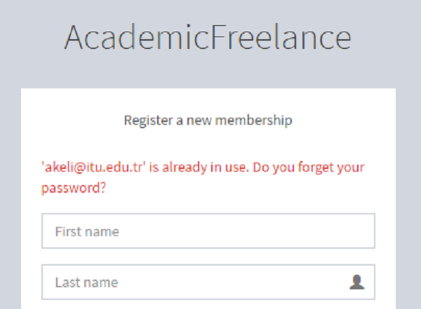
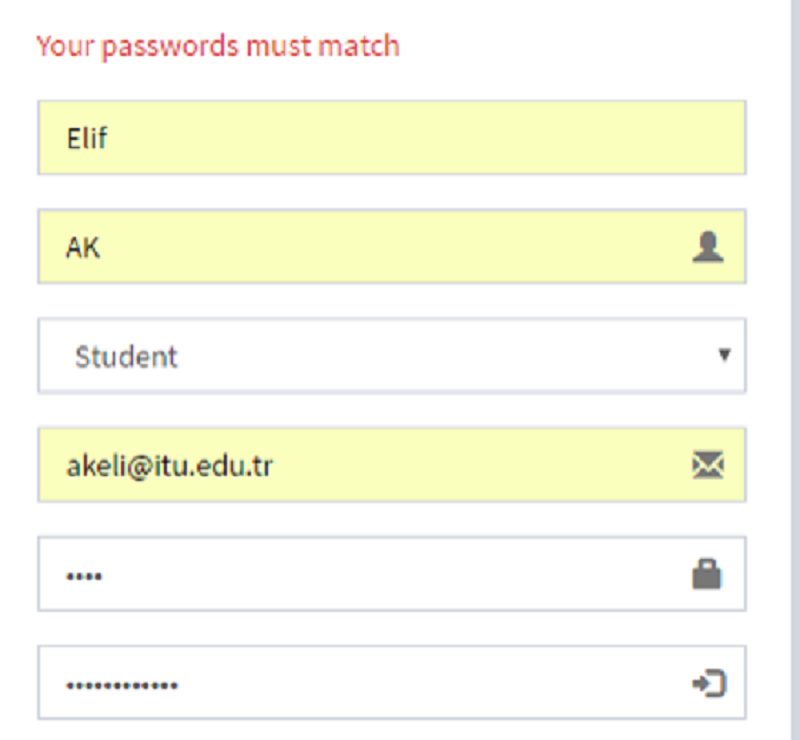
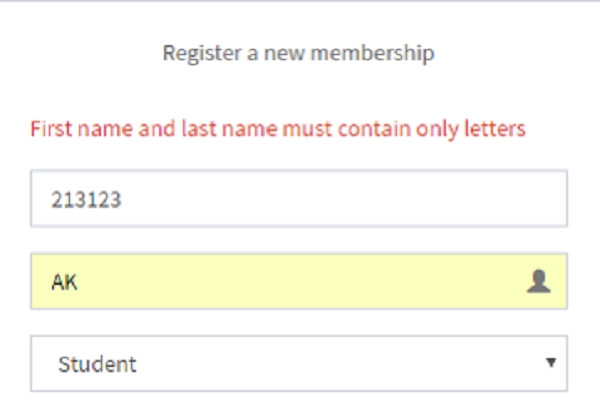
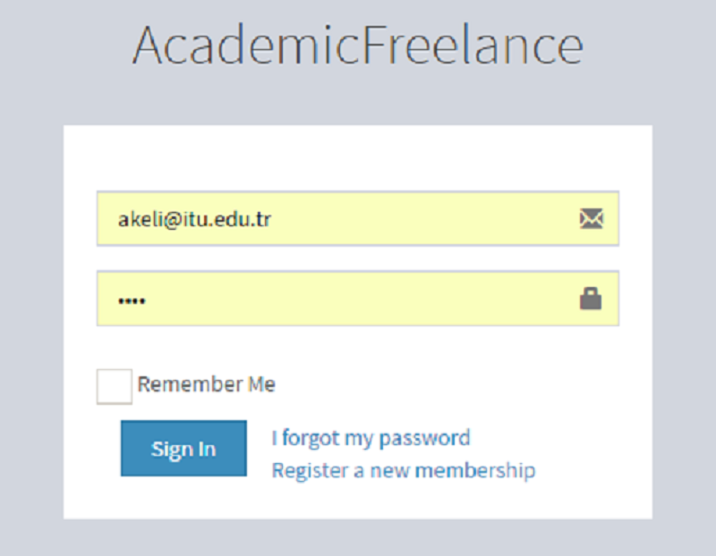

Parts Implemented by Elif Ak
============================

Person
------
If you have no account, you can register like using following steps.

1. You can use the link to access `Register Page <http://itucsdb1611.mybluemix.net/register>`_

      Register page view

There are some validation controls while register. You should be careful.

2. While creating new account, you should fill the required informations.

      Required informations

3. You shouldn’t register with same e-mail! E-mail must be unique.

      Unique email

4. Passwords must match!

      Passwords must match

5. You should enter proper values. For example, name value coudn't contain numbers.

      Proper values

6. After a succesful register, you direct to login page. Enjoy with Academic Freelance!

      Login