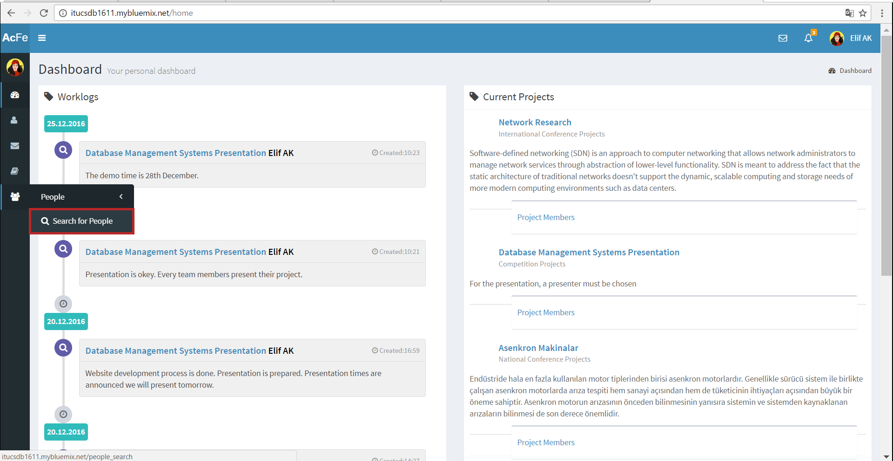
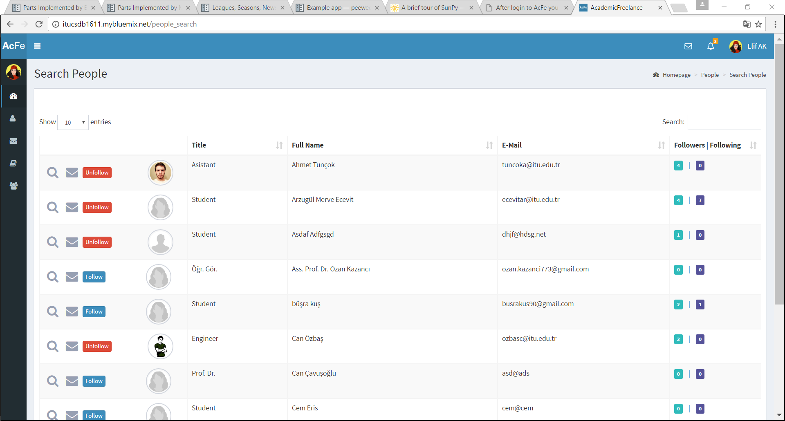
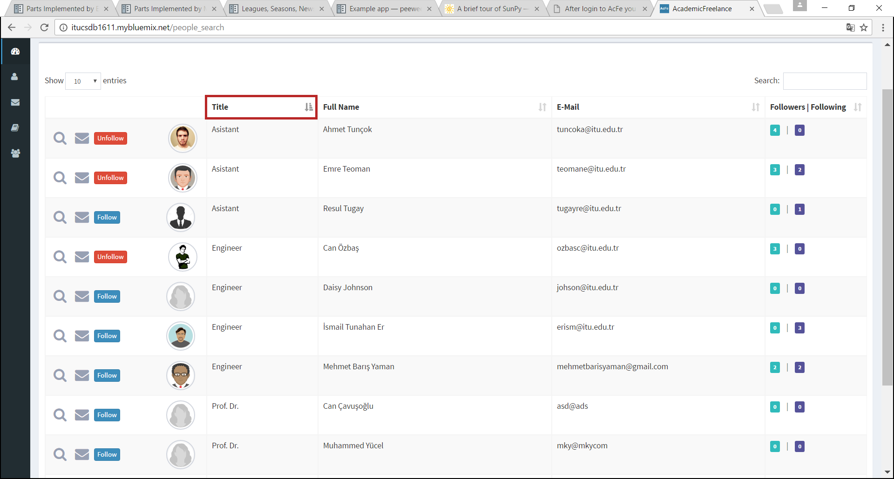

Parts Implemented by Elif Ak
============================

Person
------
If you have no account, you can register like using following steps.

1. You can use the link to access `Register Page <http://itucsdb1611.mybluemix.net/register>`_

.. figure:: member2/1-register_general.png
      :scale: 50 %
      :align: center
      :alt: Register page view

      Register page view

There are some validation controls while register. You should be careful.

2. While creating new account, you should fill the required informations.

.. figure:: member2/2-validation.png
      :scale: 50 %
      :align: center
      :alt: Required informations

      Required informations

3. You shouldn’t register with same e-mail! E-mail must be unique.

.. figure:: member2/3-unique_email.png
      :scale: 50 %
      :align: center
      :alt: Unique email

      Unique email

4. Passwords must match!

.. figure:: member2/4-match-password.png
      :scale: 50 %
      :align: center
      :alt: Passwords must match

      Passwords must match

5. You should enter proper values. For example, name value coudn't contain numbers.

.. figure:: member2/5-proper-values.png
      :scale: 50 %
      :align: center
      :alt: Proper values

      Proper values

6. After a succesful register, you direct to login page. Enjoy with Academic Freelance!

.. figure:: member2/6-login.png
      :scale: 50 %
      :align: center
      :alt: Login

      Login

After login to **AcFe** you can search other members by clicking to *Search for Person* link in the Navigation.

1. You can also use the link to access `Search People Page <http://itucsdb1611.mybluemix.net/people_search>`_ or like following way.

      Person search way

2. Here the list of all people.

      Person search page view

3. You can search for a person by typing any information belongs to his/her.

	For example you can search for all asistant members in the **AcFe**

      Write any information (for example Asistant key word).

.. figure:: member2/10-filtering_result.png
      :scale: 50 %
      :align: center
      :alt: Person search by filtering result

      And you can access which you want easily.

4. You can sort the member informations according to Title, Full Name, E-Mail and Followers|Following number.

      For example you can sort members by Title.

Followed Person
---------------

The button for following/unfollowing depends on whether you follow a person.
You can go to a person’s profile detail or send a message to a person via Search Person page.

You can see that Followers and Following numbers of members.

To follow somebody, you can use following steps.

1. Click the *Follow* button in the *Search for People* page.
(If you have already follow this man, you will see the *Unfollow* button instead of *Follow* button).

      Suppose that you want to follow Gülçin. You will see *Follow* button.

      (Before) Gülçin has 3 followers.

2. Thats all! Gülçin have a new Follower! Congratulations! When you want you can break the connection in this way.

      Now you follow Gülçin. You will see *Unfollow* button.

      (After) Gülçin has 4 followers.

Education
---------
