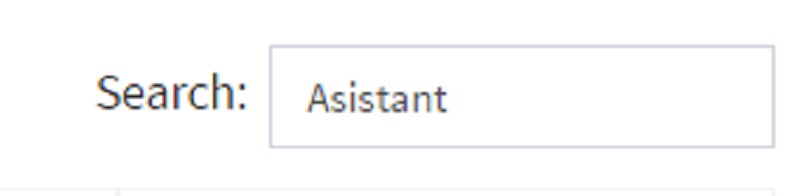
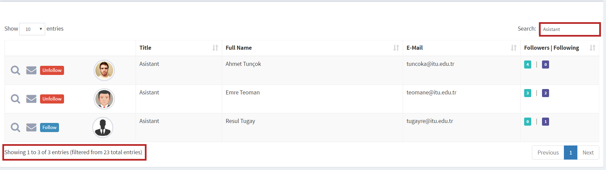
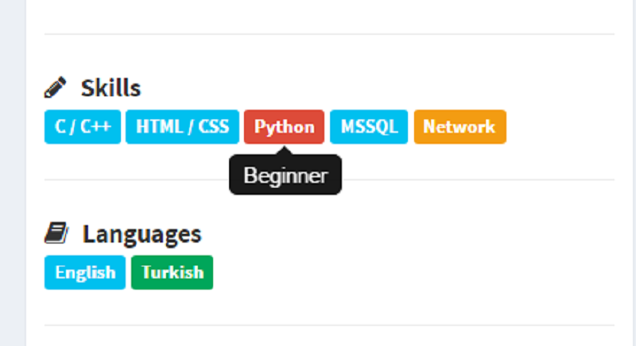

Parts Implemented by Elif Ak
============================

Person
------
If you have no account, you can register like using following steps.

1. You can use the link to access `Register Page <http://itucsdb1611.mybluemix.net/register>`_

.. image:: member2/1-register_general.png
      :scale: 50 %
      :align: center
      :alt: Register page view

There are some validation controls while register. You should be careful.

2. While creating new account, you should fill the required information.

.. image:: member2/2-validation.png
      :scale: 50 %
      :align: center
      :alt: Required information

3. You shouldn’t register with same e-mail! E-mail must be unique.

.. image:: member2/3-unique_email.png
      :scale: 50 %
      :align: center
      :alt: Unique email

4. Passwords must match!

.. image:: member2/4-match-password.png
      :scale: 50 %
      :align: center
      :alt: Passwords must match

5. You should enter proper values. For example, name value coudn't contain numbers.

.. image:: member2/5-proper-values.png
      :scale: 50 %
      :align: center
      :alt: Proper values

6. After a successful register, you direct to login page. Enjoy with Academic Freelance!

.. image:: member2/6-login.png
      :scale: 50 %
      :align: center
      :alt: Login

After login to **AcFe** you can search other members by clicking to *Search for Person* link in the Navigation.

1. You can also use the link to access `Search People Page <http://itucsdb1611.mybluemix.net/people_search>`_ or like following way.

.. image:: member2/7-searchpeople.png
      :scale: 50 %
      :align: center
      :alt: Person search way

2. Here the list of all people.
      For example you can search for all assistant members in the **AcFe**

.. image:: member2/8-list_people.png
      :scale: 50 %
      :align: center
      :alt: Person search page view

      Person search page view

3. You can search for a person by typing any information belongs to his/her.

Write any information (for example Asistant key word).

      And you can access which you want easily.

4. You can sort the member information according to Title, Full Name, E-Mail and Followers|Following number.

      For example you can sort members by Title.

.. image:: member2/11-sorting_result.png
      :scale: 50 %
      :align: center
      :alt: Person sorting

Followed Person
---------------

The button for following/unfollowing depends on whether you follow a person.
You can go to a person’s profile detail or send a message to a person via Search Person page.

To follow somebody, you can use following steps.

1. Click the *Follow* button in the *Search for People* page.
(If you have already follow this man, you will see the *Unfollow* button instead of *Follow* button).
      Suppose that you want to follow Gülçin. You will see *Follow* button.
      (Before) Gülçin has 3 followers.

.. image:: member2/12-before_following.png
      :scale: 50 %
      :align: center
      :alt: Person follow

.. image:: member2/13-before_following_numbers.png
      :scale: 50 %
      :align: center
      :alt: Person follow number before

2. That's all! Gülçin have a new Follower! Congratulations! When you want you can break the connection in this way.

      Now you follow Gülçin. You will see *Unfollow* button.

      (After) Gülçin has 4 followers.

.. image:: member2/14-after_following.png
      :scale: 50 %
      :align: center
      :alt: Person follow before

.. image:: member2/15-after_following_numbers.png
      :scale: 50 %
      :align: center
      :alt: Person follow number before

Education
---------

When you view your own CV, you can add an Education information about you.

      You can add new Education using Education Modal by clicking the ‘Add’ icon.

Here is the Education partition. You can list your education information which you have saved before.
      The view of education partition.

After clicking *Add* button, you will see *Education Modal* on the screen.
      You can add new Education information by filling the value places.

Here is a example of adding new University information.

In this example, Istanbul Technical University information is added as education.
You can select start and end year using *year datepicker* easily. And by clicking the **Save** button you can store informations.

.. image:: member2/19-adding_education.png
      :scale: 50 %
      :align: center
      :alt: Education add

Now, there are two information about Istanbul Technical University. Below one is added newly.
You can edit and delete using right hand side icons.

After cilicking to *Edit* icon, again it is opened modal page to edit information. Now, value field is fill with updated information.
      For example, you aware of that start-end years is incorrect. And suppose your graduation grade is change. Above there are **editted informations**

And againg you aware of that there were already a entity about your Istanbul Technical University education information.
You can delete by clicking cross icon.

      Before the deletion of information, there was a confirmation about deletion. Click the **Tamam** to delete.

      Again, there are two entity. Repeated ones is deleted.

After all of thinngs, here your **Personal Page**. There are a lot of thing to do. Here we go!

1. On the left bottom side, there is *About Panel* which you and other members can view your CV in profile page.
      If you want changing, you can click the edit button. Don't worry, you can only see your own CV edit button.

      Your education information in your *Profile page*. And there are also other CV information.

And also you can see *Skills* and *Langauge* Information by coloring. Yes, of course there are meaning of color. Here is the explanations:

- Red		: Beginner
- Yellow	: Intermediate
- Light Blue	: Advance
- Dark Blue	: Expert
- Green	: Master

Here is a example.
      You can see the levels by hovering the information.

There are a lot of tabs in the right hand side. You can see the explanations about **Followers|Following** tab and **Settings** tab.

	You can see your followers and members which you follow in **Followers|Following** tab.
      If there is no record related to followers and following, you will see the warning which you promote to find new person!

	In this case, current user has a lot of connection!
      By clicking the person, you can go to profile detail.

	Here is the **Settings** tab. You can change every profile information in this tab.
      If you leave blank your password and profile image partitions, these value is not change.

	Settings tab is not shown while showing other’s profile pages.
      Here there is a other member profile page and you cannot see **Settings** tab.

In the top right hand side, you can also see your following and followers numbers.
      For example, Elif Ak has 6 followers and she follow 9 members.

.. image:: member2/33-follow_numbers.png
      :scale: 50 %
      :align: center
      :alt: Followers|Following numbers

Ont he other hand top of the navigation bar there are three icon. Most right hand site can be used like following.

      You can see last members in real time. It is refresh automatically for you!

      You can see loggin information on the right hand side icon.