Parts Implemented by Gülçin Baykal
================================

**Project, Project Comment and Information tables are implemented.**

Related Parts to Project
------------------------
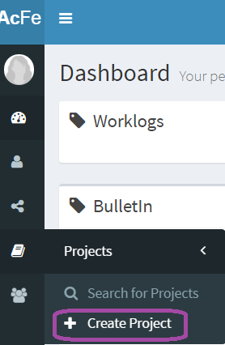

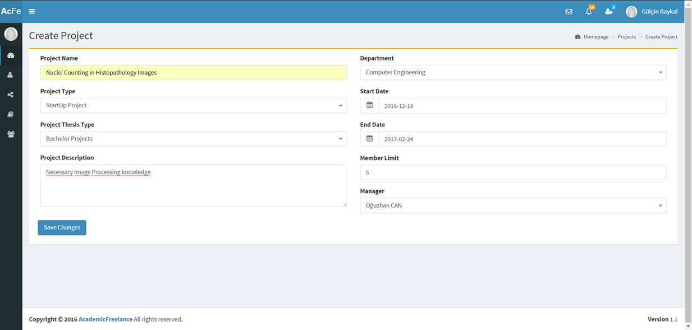

There are many choices for you to select!

Tubitak Projects, Competition Projects, International Conference Projects, National Conference Projects, Commercial Projects and StartUp Projects are available. Besides from that, if you are a student and searching for a Thesis Project, we also have Bachelor Projects, Master Projects and PhD Projects for you.

All the departments of ITU are available in our website and any department can create a project for a co-worker.

You can set a member limit for your project and assign a person as the manager of the project. Start date and end date are selectable by datetime picker.  “Save Changes” and create your own Project!

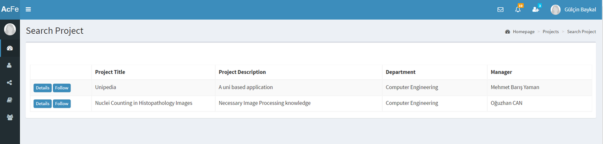

If you click Details to see more information about a Project, you will be directed to that project’s details page.

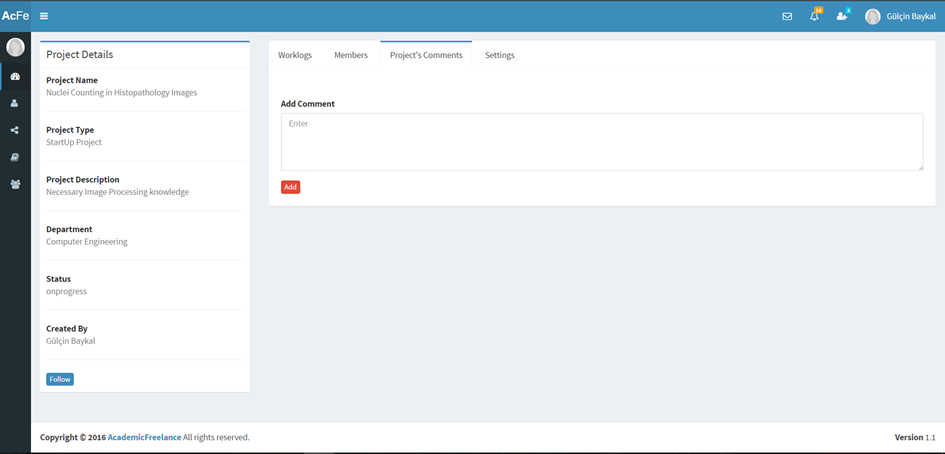

On the left part of the page, you can see specific information about the Project. Since the logged in user is viewing the Project, Settings tab is shown. When you want to see a project’s detail which you are not the creator of, you cannot see Settings tab.

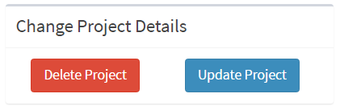

If you are the creator of the project, in the Settings tab, you will see Delete and Update buttons. You can delete your own project and update it!

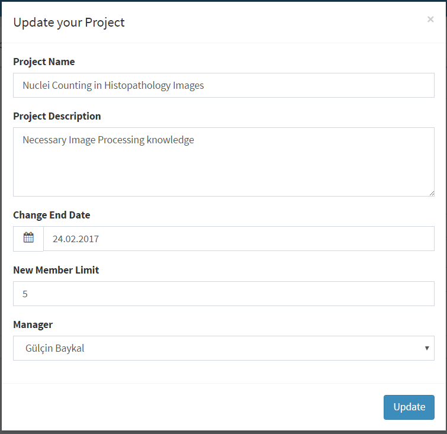

You can update specific information about your project.

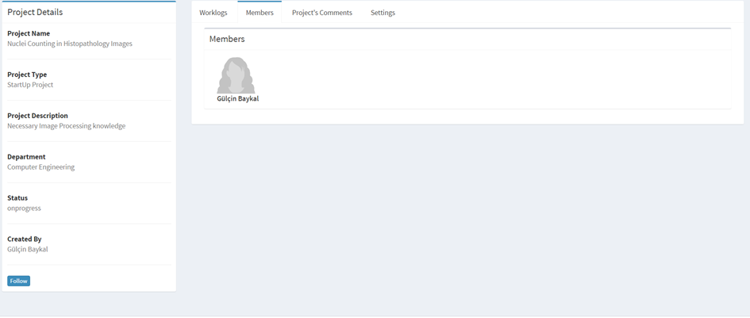

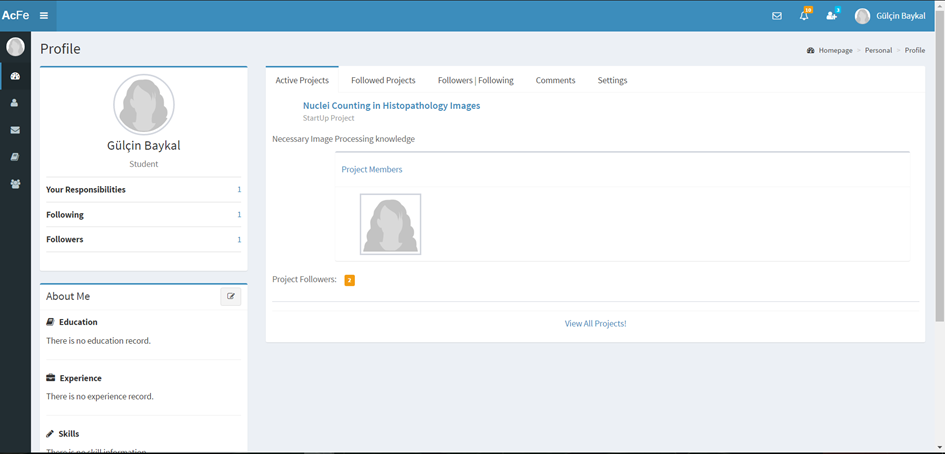

Since the user is the member of “Nuclei Counting in Histopathology Images” Project, when she/he goes to her/his Profile, she/he can see active projects of herself/hisself. Her/his responsibility number is also shown. You can see everybody’s active projects in her/his profile.

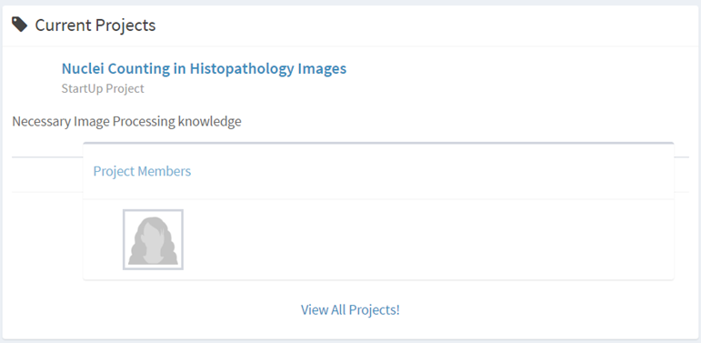

When you come to your dashboard, you can see your current projects and it is a reminder for you to work!

Related Parts to Project Comment
--------------------------------

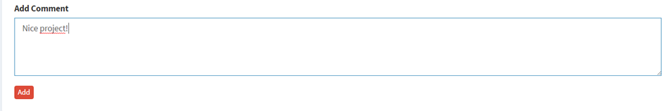

You can leave a comment to the Project in Project's Comments tab.

.. image:: member3/Resim7.png
      :scale: 50 %
      :align: center
      :alt: map to buried treasure

You can make changes only on your own comments.

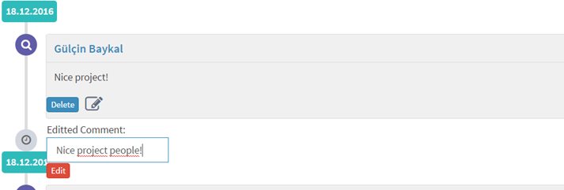

.. image:: member3/3.PNG
      :scale: 50 %
      :align: center
      :alt: map to buried treasure

You can update your comment.

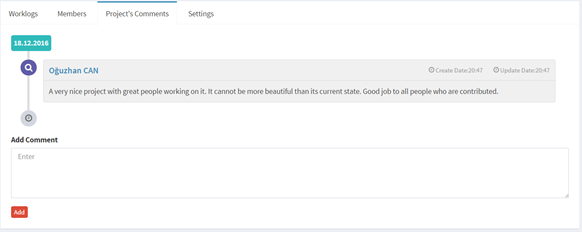

Related Parts to Information
----------------------------

When you view your own CV, you can add E-Mail, Telephone, Twitter, LinkedIn, Facebook, Instagram, Blog, MySpace, Tumblr, Address information  to your CV!

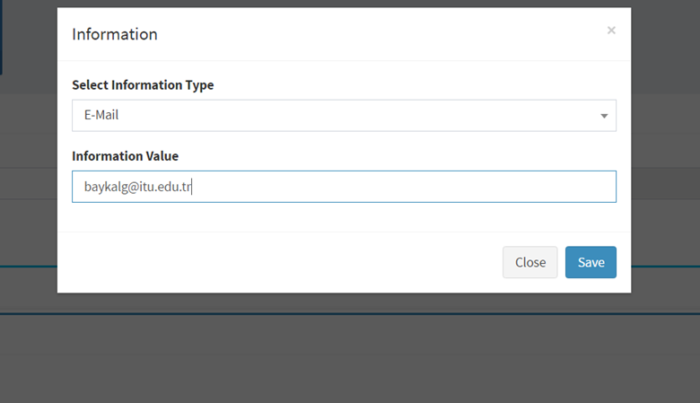

Add information by clicking ‘Add’ icon.

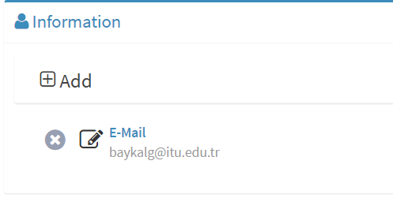

E-Mail information is added by the user.

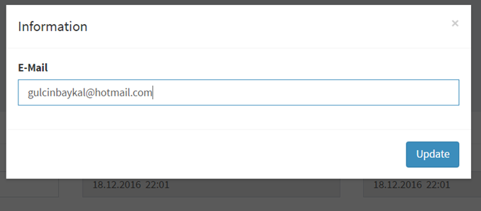

Added information can be updated.

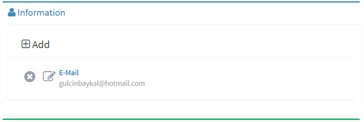

Here is the result.

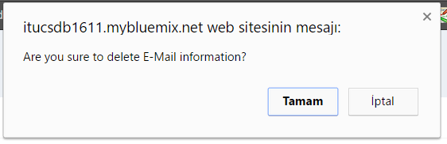

When you click cross symbol, you can delete an information and before deletion, a warning is shown.

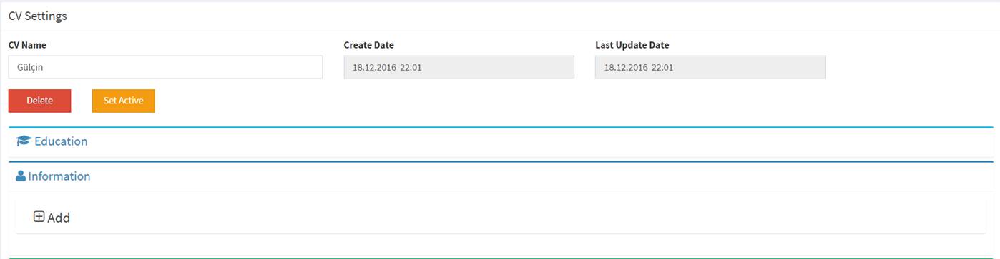

Now, your information is deleted!
