Parts Implemented by Güllü Katık
================================

**Followed Project, Worklog and Skill tables are implemented.**

Related Parts to Followed Project
---------------------------------

All projects are shown on search project page with a follow or unfollow button. You can follow or unfollow projects by clicking this buttons.

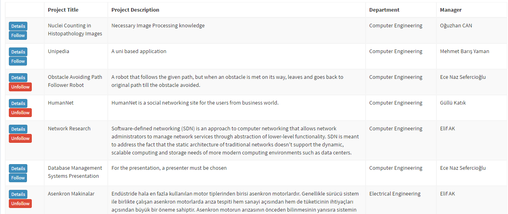

This buttons are also available on projects' detail page.

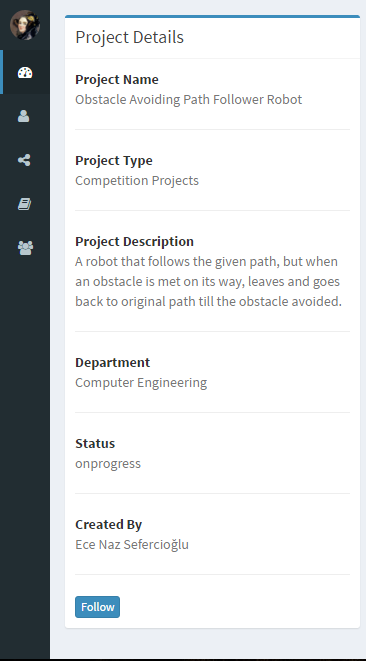

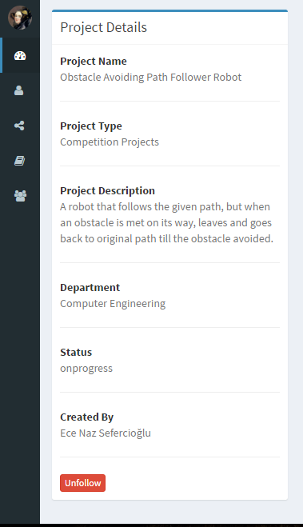

Projects that followed by a user are shown her/his profile

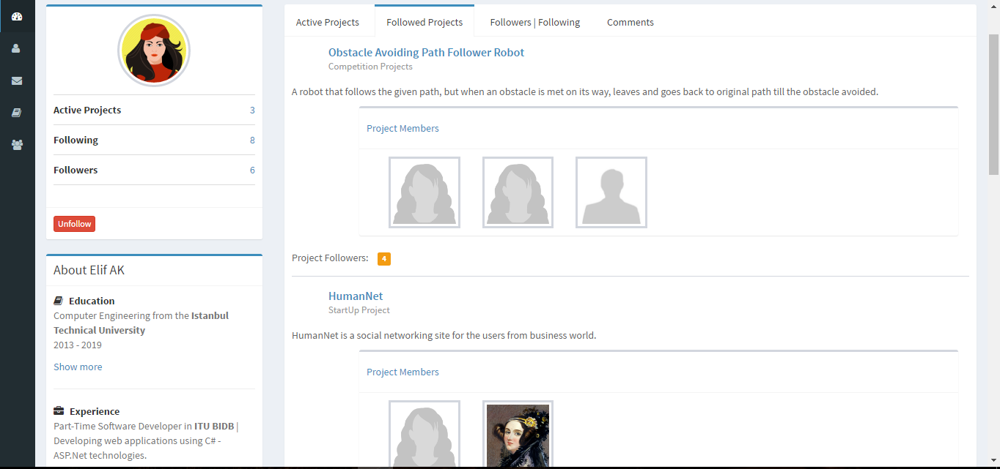

Related Parts to Worklog
------------------------

If you are a member of a project, you can add worklog to that project in worklogs tab.

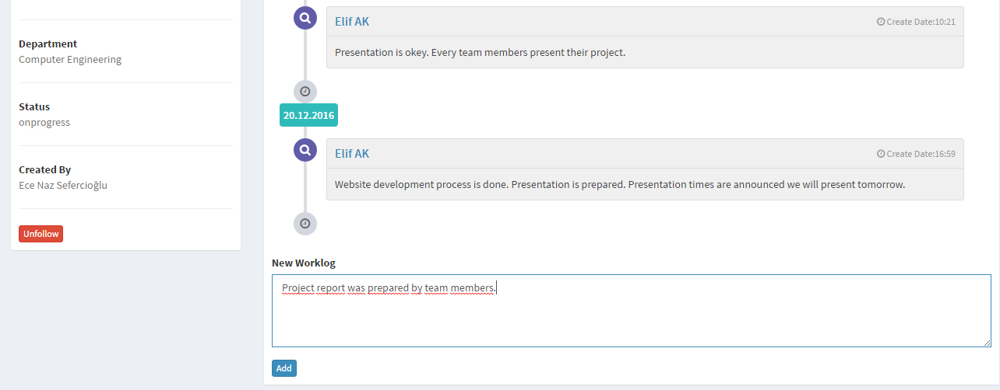

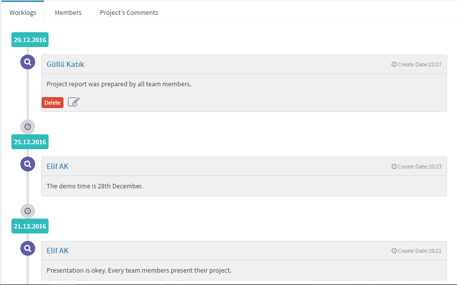

You can edit only on your own worklogs.

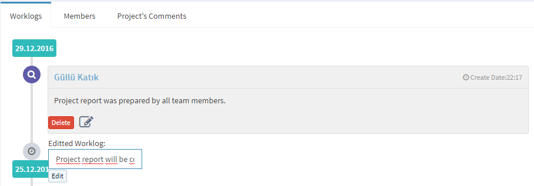

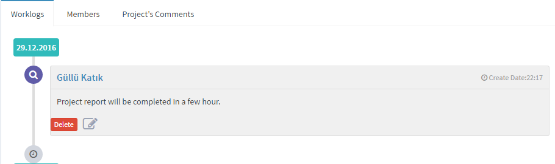

Also you can delete your worklogs by clicking delete button.

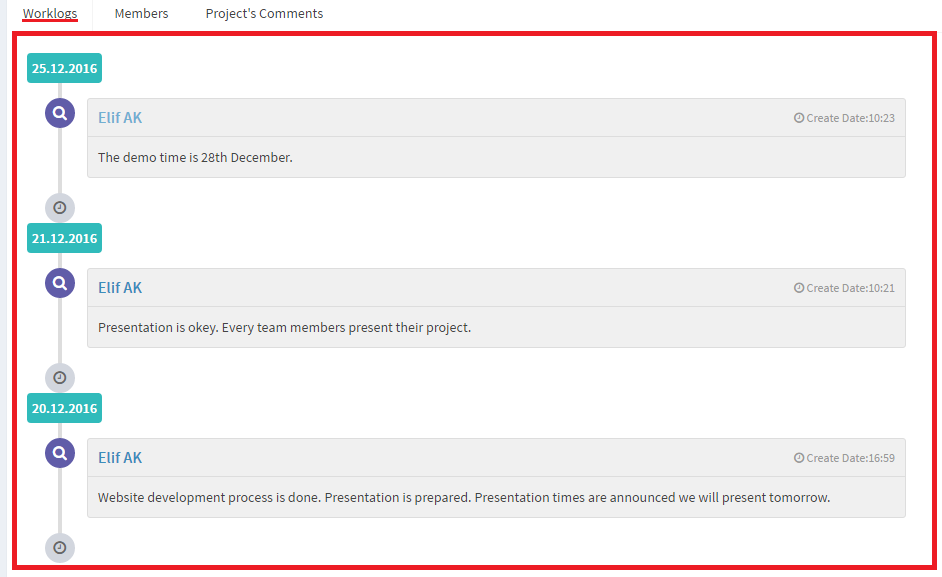

Worklogs of the projects followed by you, are shown on your home page

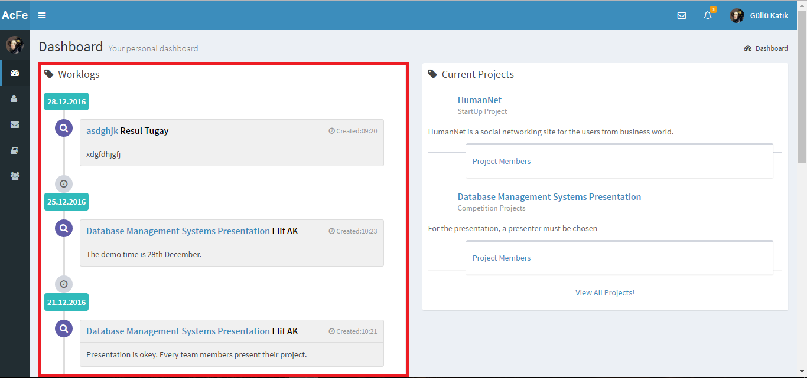

Related Parts to Skill
----------------------

You can add new skill to your Cv.

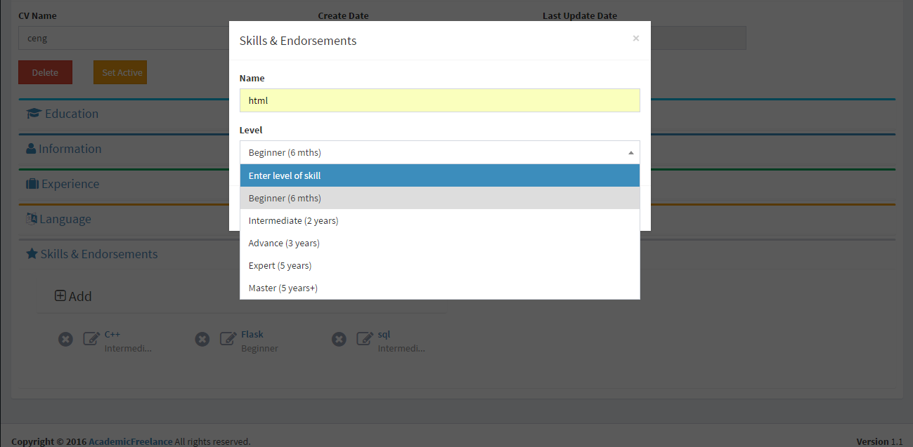

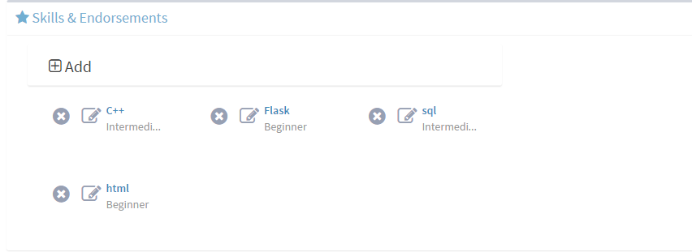

You can update your skills' name, level or both of them by clicking edit icon.

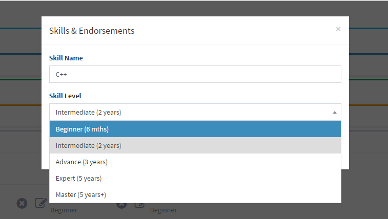

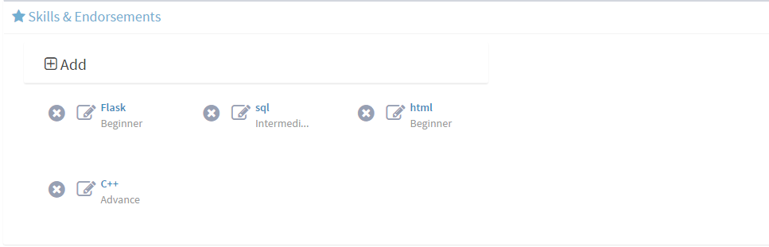

When you click the cross icon, a warning is shown and after you confirm the skill is deleted from yor CV.

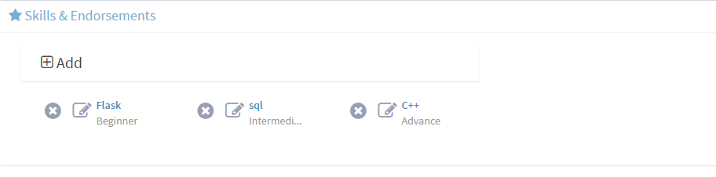

