Parts Implemented by Mehmet Barış Yaman
=======================================

**Language, Person Comment and Team tables are implemented.**

Login Operations
----------------
When you try to open the web site the first page will be the login page. In that page if you write wrong password you will see the same page with warning:

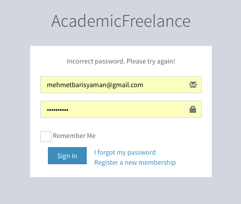

      Login Page Email Error

If your E-Mail is wrong then the warning will be:

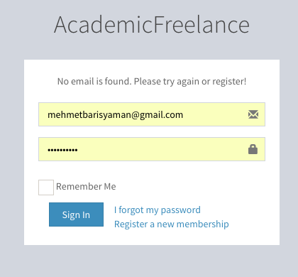

      Login Page E-Mail Error

After you type the email and password correctly, you will be redirected the dasboard(home) page as below.

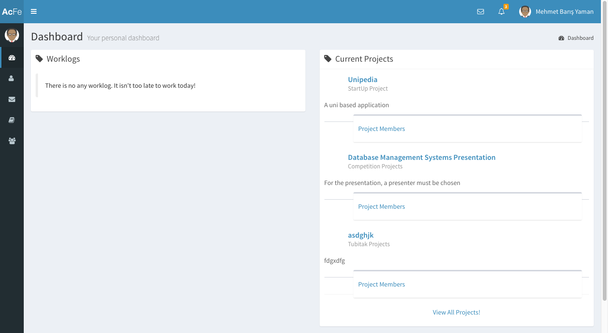

      Home Page

Related Parts to Language Table
-------------------------------
Then for adjusting the language held in CV, you need to choose "CV" in left panel as:

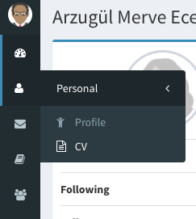

      Choose CV In Left Panel

Now, CV page is opened. At first, the page looks like:

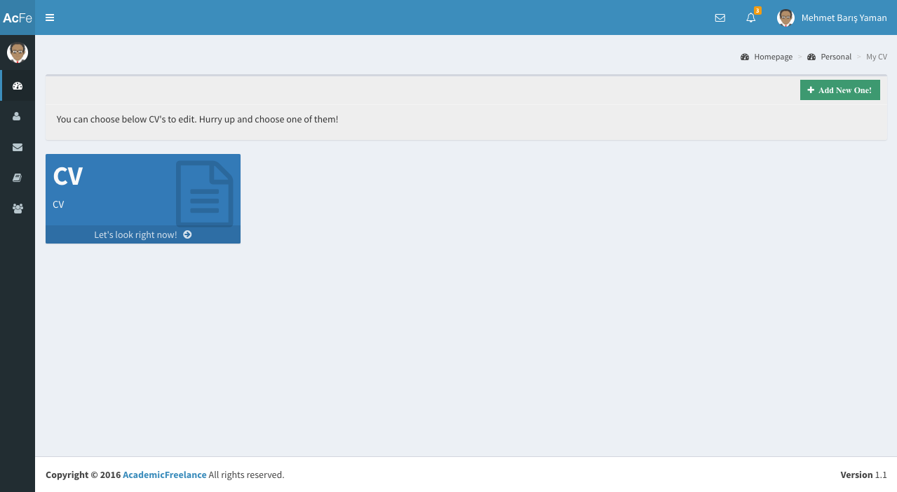

      CV Page At First Glance

You need to click "Let's Look At your CV" row in order to see the parts related to your CV. Click "Language" part to see all information about your languages.

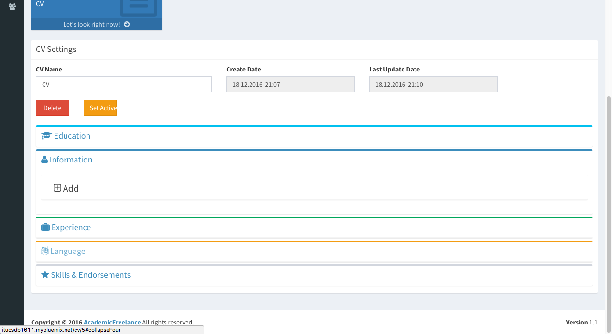

      Language Part Dropdown

You can add new language by clicking the add button.

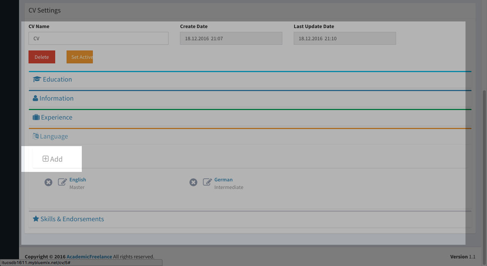

      Language Add Button

Fill necessary information and click "Save" button in the popup opened.

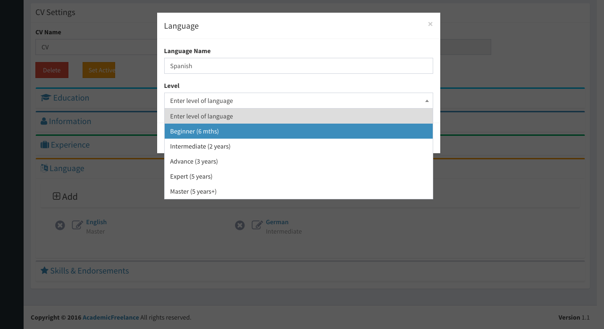

      Language Add Pop Up

You can update any language by clicking the button that is near each language as below.

Note that, updating German is an example in the photo below. You can update any language you want.

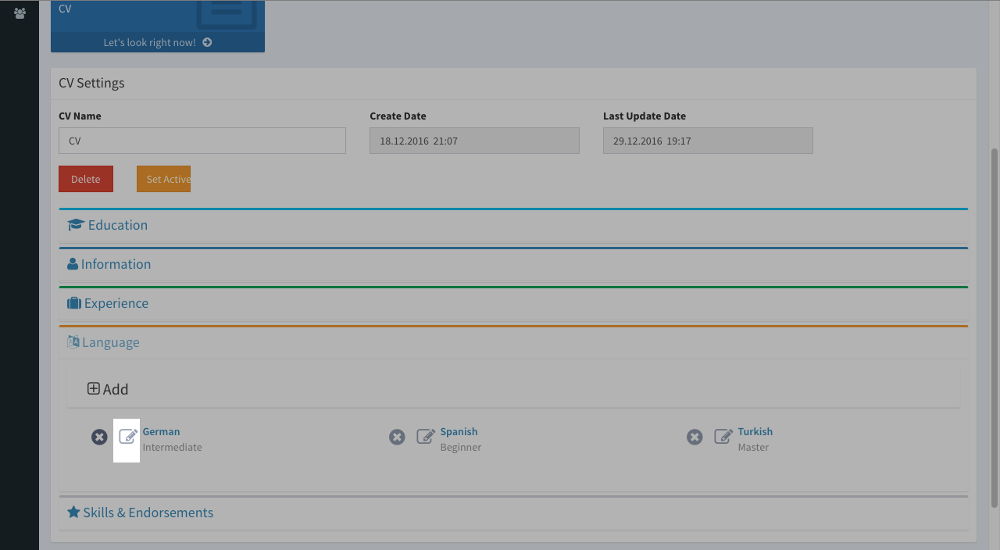

      German Language Update Button

Then, fill necessary information and click "Update".

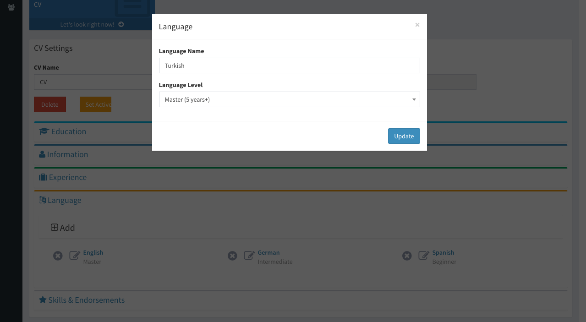

      German Language Update Pop - Up

Lastly, you can delete any language you want by clicking "x" button near the language.

Click "OK" in order to delete the language.

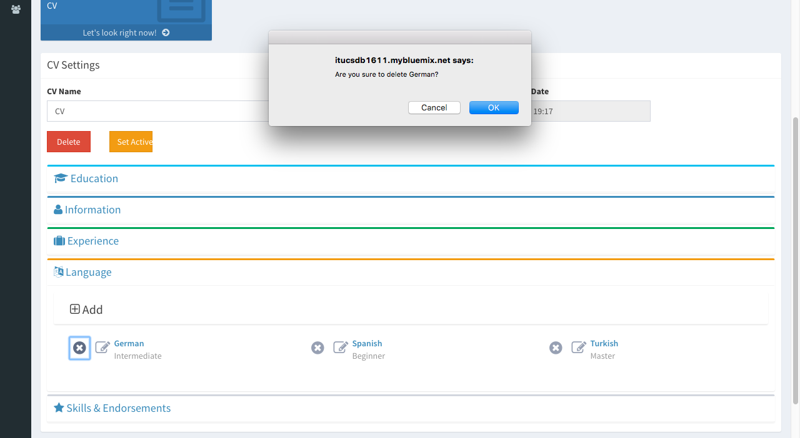

      Language Part Dropdown

Now, you visualize all the process in language operations. Let's look at the other tables!

Related Parts to Person Comment Table
-------------------------------------
At first, you need to click "Search For People" in the left panel.

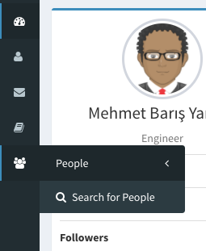

      Search For People Button In Left Panel

Write any attribute of a person that you search for on the search bar, which is in up right corner of the page.

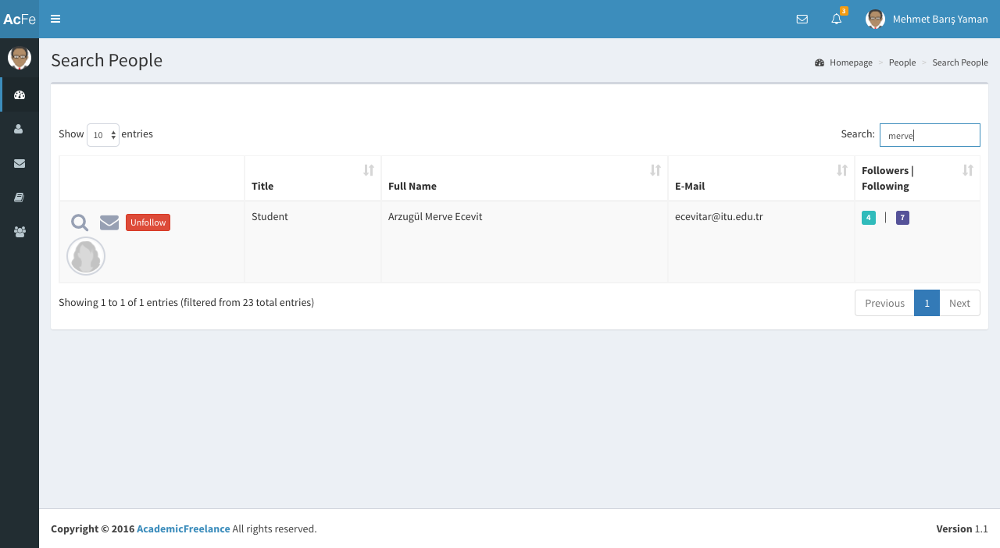

      Find Person Using the Search Bar

Click the button which is in the photo below, in order to access the profile page of the person.

      Accessing Profile Page Of The User

Click "Comments" Tab in order to see the comments in te profile page.

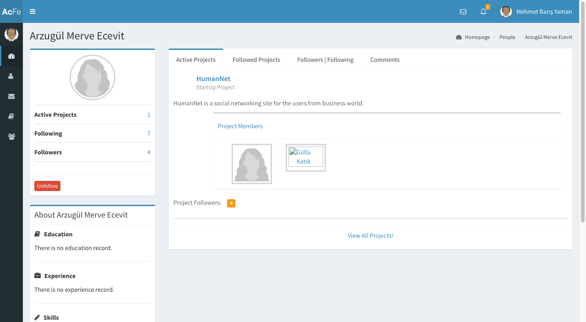

      Profile Page

Now look at the comments.

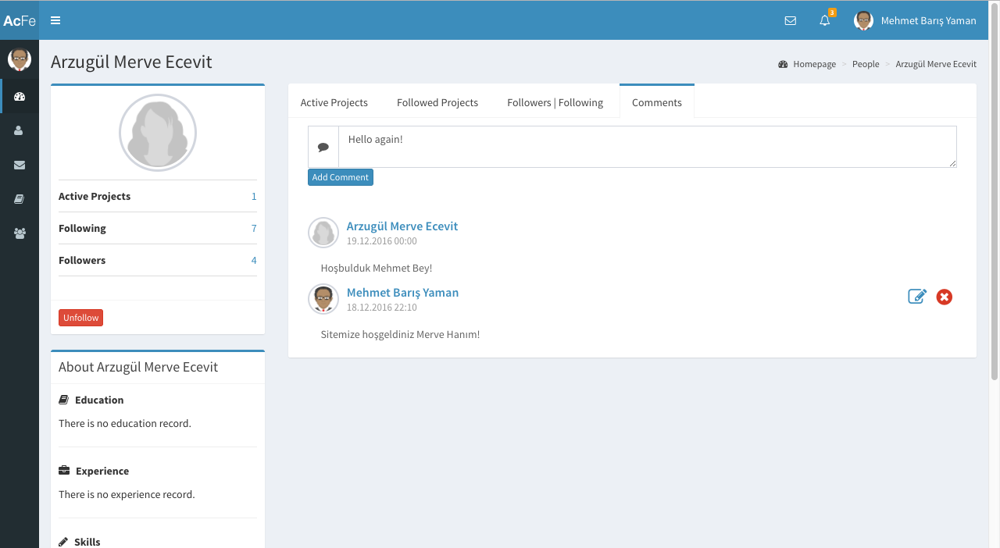

      Profile Page Comments Tab

Here, you can add comments using the part of the page that is in the photo below.

Write a comment and click "Add Comment" button.

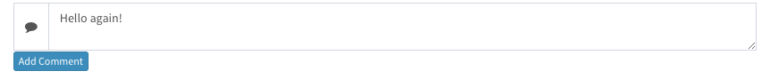

      Add Comment Part

You can update your comments (only yours!) by using the button that is:

      Update Comment Button

Write the new comment in the popup shown and click "Update".

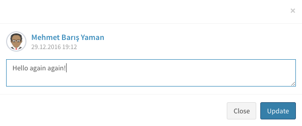

      Update Comment Pop Up

You can delete any comments using the "x" button and clicking "OK" after that.

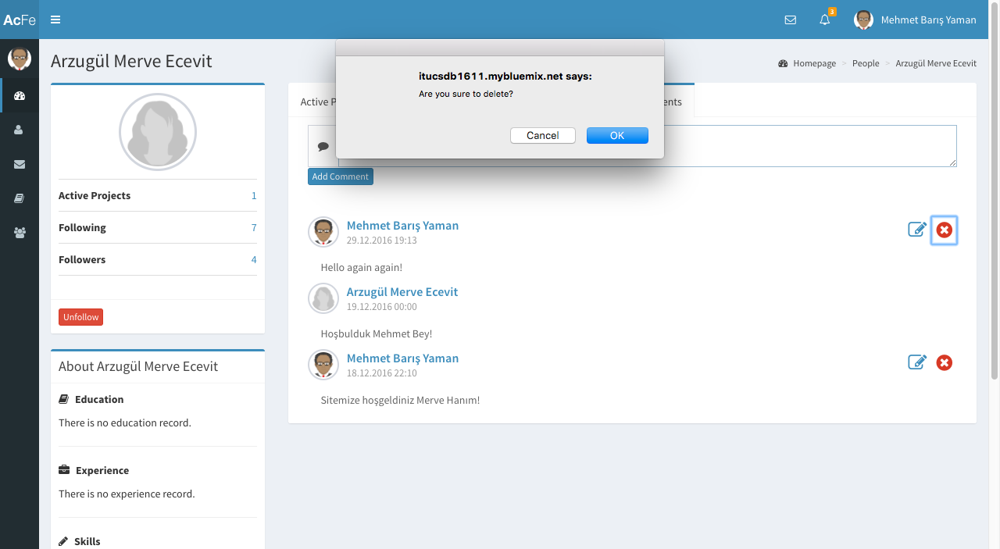

      Delete Comment Part

Now you can comment any time you want!

Related Parts to Team Table
---------------------------
At first, you need to click "Search For Projects" in the left panel as below.

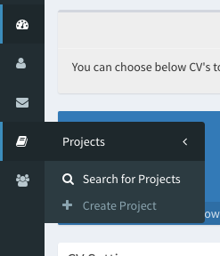

      Search For Projects Button In Left Panel

Choose any project that you are the creator of that. Because you can not adjust projects that you are not the creator of!

Click "Details" to access the project details.

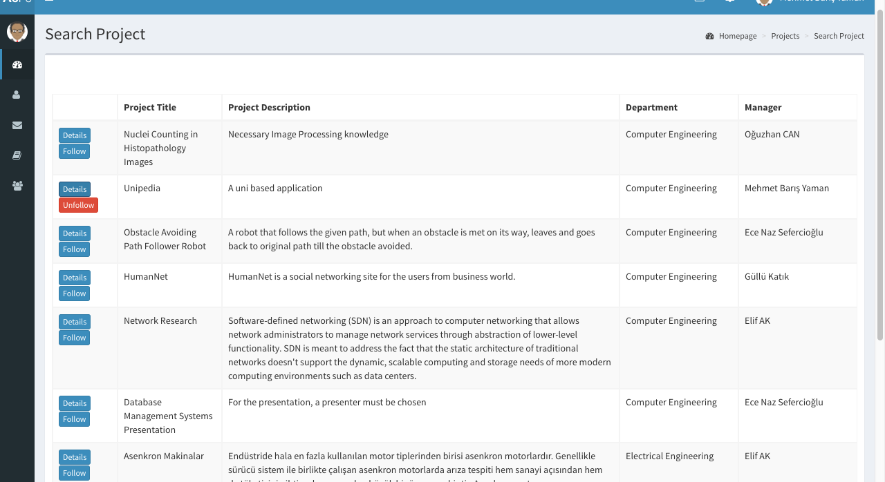

      Project Search Page

Then you will be redirected to the Project Details page. Click members tab in order to see the members in the project.

Note that, independent of the creator or not, all users can see the members in a project.

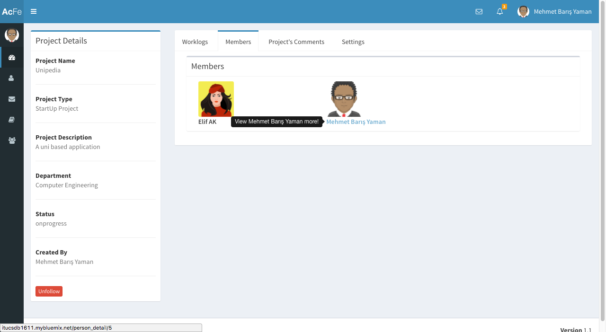

      Project Details Page Members Tab

Click "Settings" tab for adjusting the project. If you are not the creator, you can not see that tab.

Therefore other users can not adjust the project that you created.

.. figure:: member5/25.png
      :scale: 50 %
      :align: center
      :alt: map to buried treasure

      Project Details Page Settings Tab

For adding new members in a project, write any name in the adding part below.

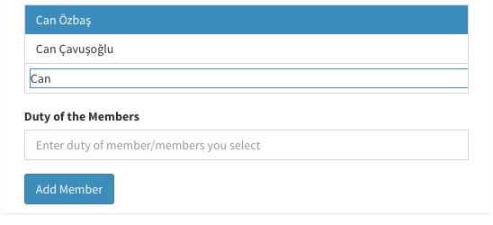

      Project Details Page Adding Part

Choose the person corresponding to your search key.

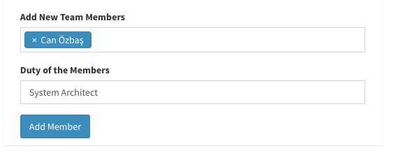

      Project Details Page Adding Part

Click "Add Member" to add. Then you will be redirected to "Members" tab.

Click "Settings" tab again. Now look at each member in the project.

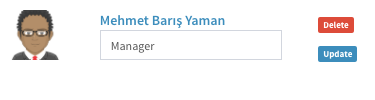

      Project Member Adjustment

You can write new duty of any member in the project and click "Update" button if you want to change a member's duty.

Click delete if you want to delete the member.

Now you can adjust anything related on your projects. Have a good work!

Logout Operation
----------------
After your work is finished you can logout using the up right corner of the page as below.

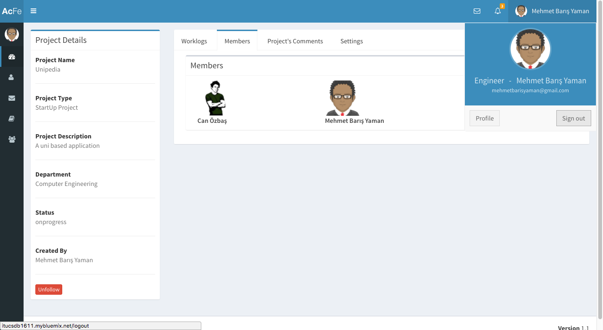

      Search For Projects Button In Left Panel