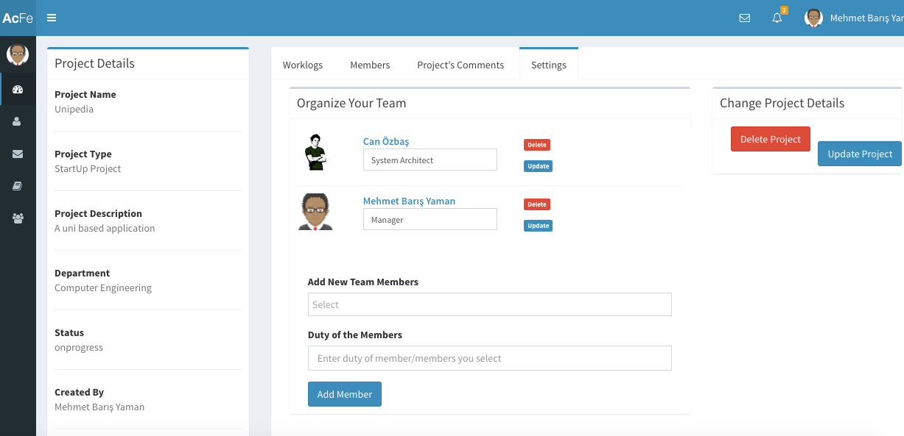

Parts Implemented by Mehmet Barış Yaman
=======================================

**Language, PersonComment and Team tables are implemented.**

Login Operations
----------------
When you try to open the web site the first page will be the login page. In that page if you write wrong password you will see the same page with warning:

.. image:: member5/0.png
      :scale: 50 %
      :align: center
      :alt: map to buried treasure

If your E-Mail is wrong then the warning will be:

After you type the email and password correctly, you will be redirected the dashboard(home) page as below.

Related Parts to Language Table
-------------------------------
Then for adjusting the language held in CV, you need to choose "CV" in left panel as:

Now, CV page is opened. At first, the page looks like:

.. image:: member5/5.png
      :scale: 50 %
      :align: center
      :alt: map to buried treasure

You need to click "Let's Look At your CV" row in order to see the parts related to your CV. Click "Language" part to see all information about your languages.

You can add new language by clicking the add button.

Fill necessary information and click "Save" button in the popup opened.

You can update any language by clicking the button that is near each language as below.

Note that, updating German is an example in the photo below. You can update any language you want.

.. image:: member5/9.png
      :scale: 50 %
      :align: center
      :alt: map to buried treasure

Then, fill necessary information and click "Update".

.. image:: member5/10.png
      :scale: 50 %
      :align: center
      :alt: map to buried treasure

Lastly, you can delete any language you want by clicking "x" button near the language.

Click "OK" in order to delete the language.

.. image:: member5/12.png
      :scale: 50 %
      :align: center
      :alt: map to buried treasure

Now, you visualize all the process in language operations. Let's look at the other tables!

Related Parts to Person Comment Table
-------------------------------------
At first, you need to click "Search For People" in the left panel.

.. image:: member5/13.png
      :scale: 50 %
      :align: center
      :alt: map to buried treasure

Write any attribute of a person that you search for on the search bar, which is in up right corner of the page.

Click the button which is in the photo below, in order to access the profile page of the person.

.. image:: member5/15.png
      :scale: 50 %
      :align: center
      :alt: map to buried treasure

Click "Comments" Tab in order to see the comments in te profile page.

Now look at the comments.

.. image:: member5/17.png
      :scale: 50 %
      :align: center
      :alt: map to buried treasure

Here, you can add comments using the part of the page that is in the photo below.

Write a comment and click "Add Comment" button.

You can update your comments (only yours!) by using the button that is:

Write the new comment in the popup shown and click "Update".

.. image:: member5/20.png
      :scale: 50 %
      :align: center
      :alt: map to buried treasure

You can delete any comments using the "x" button and clicking "OK" after that.

.. image:: member5/21.png
      :scale: 50 %
      :align: center
      :alt: map to buried treasure

Now you can comment any time you want!

Related Parts to Team Table
---------------------------
At first, you need to click "Search For Projects" in the left panel as below.

.. image:: member5/22.png
      :scale: 50 %
      :align: center
      :alt: map to buried treasure

Choose any project that you are the creator of that. Because you can not adjust projects that you are not the creator of!

Click "Details" to access the project details.

Then you will be redirected to the Project Details page. Click members tab in order to see the members in the project.

Note that, independent of the creator or not, all users can see the members in a project.

.. image:: member5/24.png
      :scale: 50 %
      :align: center
      :alt: map to buried treasure

Click "Settings" tab for adjusting the project. If you are not the creator, you can not see that tab.

Therefore other users can not adjust the project that you created.

For adding new members in a project, write any name in the adding part below.

Choose the person corresponding to your search key.

Click "Add Member" to add. Then you will be redirected to "Members" tab.

Click "Settings" tab again. Now look at each member in the project.

.. image:: member5/28.png
      :scale: 50 %
      :align: center
      :alt: map to buried treasure

You can write new duty of any member in the project and click "Update" button if you want to change a member's duty.

Click delete if you want to delete the member.

Now you can adjust anything related on your projects. Have a good work!

Logout Operation
----------------
After your work is finished you can logout using the up right corner of the page as below.

